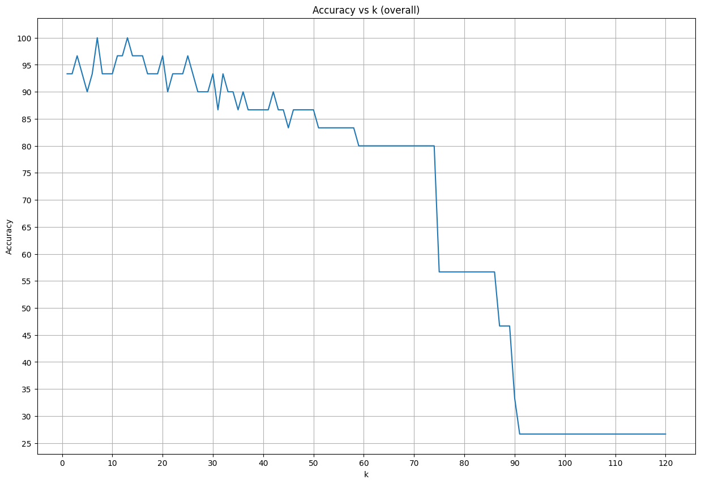
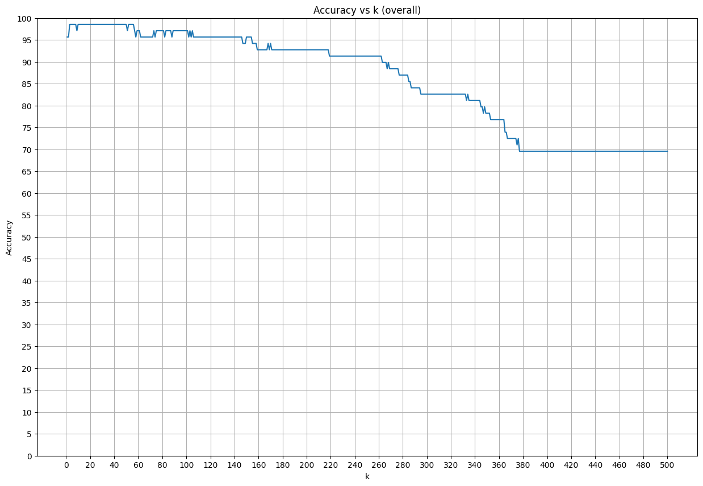

# K-Nearest Neighbors (KNN) Model

This project demonstrates the implementation of a K-Nearest Neighbors (KNN) algorithm. The goal is to predict the optimal value of `k` for various datasets.

## Objectives
1. Implement a KNN model from scratch.
2. Use the `sklearn` KNN model to predict and validate optimal values of `k`.
3. Compare the results of my model and the `sklearn` model.

## Datasets
- [Iris Dataset](https://www.kaggle.com/uciml/iris)
- [Breast Cancer Dataset](https://www.kaggle.com/uciml/breast-cancer-wisconsin-data)

## Implementation Details

### Custom KNN Model

- Computes the distances between data points.
- Identify the `k` nearest neighbors for classification.
- Evaluate model accuracy for different values of `k`.

### Sklearn KNN Model
- The `KNeighborsClassifier` from `sklearn` is also used for the same. 

### Accuracy vs k
- the graph between accuracy and k is plotted for a range of values of `k`.

## Results
- The results of the custom model and the sklearn model were more or less the same.
- **Iris Dataset**:
  - Optimal `k`: 13
  - Accuracy: 100%

- **Breast Cancer Dataset**:
  - Optimal `k`: [3,56]
  - Accuracy: 98.55%

## Made By-
**Yash Kumar**
- [**GitHub**](https://github.com/yashk1690)
- [**LinkedIn**](https://www.linkedin.com/in/yash-kumar-504649323)

